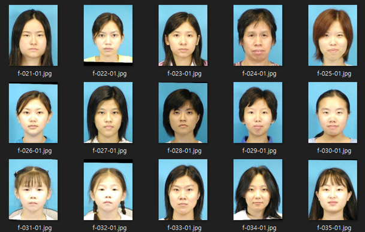
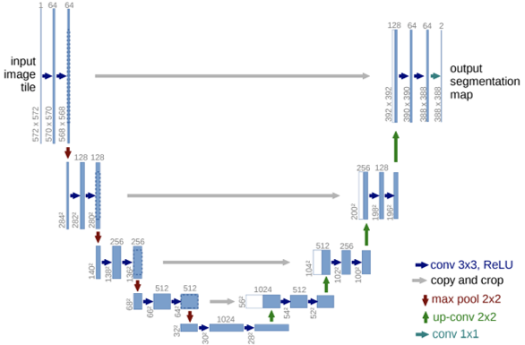

# Unet_sketch_image

2021-2 영상처리와딥러닝 수업 기말프로젝트

#### **프로젝트 주제**

###### 실제 인물 사진을 이용하여 sketch이미지를 출력하는 모델

#### **Dataset** 

###### CUHK Face Sketch Dataset(CUFS)

|                          Real Image                          |                         Sketch image                         |
| :----------------------------------------------------------: | :----------------------------------------------------------: |
|  |  |

#### **Model**

###### skip connection이 존재하는 Unet구조 사용

------

#### validation 결과

 

#### Test 결과

